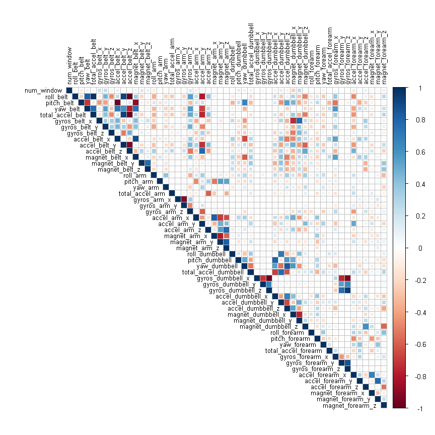
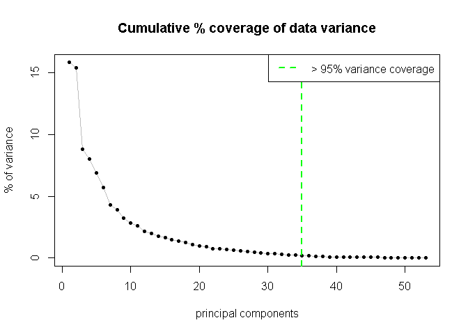
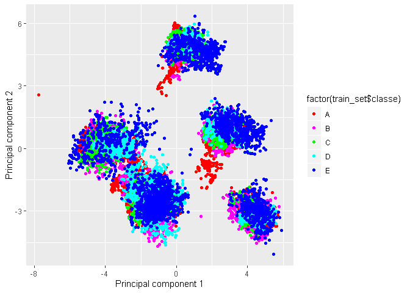

---
title: "Activity tracking analysis and prediction"
author: "Mandar Joshi"
date: "31/7/2019"
output: 
  html_document:
    keep_md: yes
--- 

## Overview

Using devices such as Jawbone Up, Nike FuelBand, and Fitbit it is now possible to collect a large amount of data about personal activity relatively inexpensively. These type of devices are part of the quantified self movement – a group of enthusiasts who take measurements about themselves regularly to improve their health, to find patterns in their behavior, or because they are tech geeks. One thing that people regularly do is quantify how much of a particular activity they do, but they rarely quantify how well they do it. The objective of the project is to evaluate the correctness of the weightligting execises of the participants.

Following are the steps to be followed:

1. Data cleaning and Preprocessing
2. Exploratory Data Analysis
3. Prediction Model Selection
4. Predicting Test Set Output

## Data Preprocessing 

load the training and testing set (already segregated and provided) from the online sources  and then split the training set further into training and test sets. 


```r
library(caret)
```

```
## Warning: package 'caret' was built under R version 3.6.1
```

```
## Loading required package: lattice
```

```
## Loading required package: ggplot2
```

```r
traintotal <- read.csv("pml-training.csv")
test_set <- read.csv("pml-testing.csv")

set.seed(123)

labels <- createDataPartition(traintotal$classe, p = 0.8, list = FALSE)
train_set <- traintotal[labels, ]
cross_val <- traintotal[-labels, ]

dim(train_set)
```

```
## [1] 15699   160
```

```r
dim(cross_val)
```

```
## [1] 3923  160
```

We see a lot of 'na' present in the dataset. Thus, we first clean the data by removing na where the percentage of 'na' is greater than 30%. Also, there are a lot variables with a variance almost equal to zero. We remove these too.


```r
labels_na <- apply(train_set, 2, function(x) mean(is.na(x))) > 0.5
train_set <- train_set[, -which(labels_na, labels_na == FALSE)]
cross_val <- cross_val[, -which(labels_na, labels_na == FALSE)]
test_set  <- test_set[, -which(labels_na, labels_na == FALSE)]

train_set <- train_set[ , -(1:5)]
cross_val <- cross_val[ , -(1:5)]
test_set  <- test_set[ , -(1:5)]

nearZero_index <- nearZeroVar(train_set)
train_set <- train_set[ ,-nearZero_index]
cross_val <- cross_val[ ,-nearZero_index]
test_set <- test_set[ ,-nearZero_index]

dim(train_set)
```

```
## [1] 15699    54
```

```r
dim(cross_val)
```

```
## [1] 3923   54
```

```r
dim(test_set)
```

```
## [1] 20 54
```

## Exploratory Data analysis:

Now we a correlation analysis on the training dataset. The dark marked squares (either blue or brown) indicate high correlation (positive or negative).


```r
library(corrplot)
```

```
## Warning: package 'corrplot' was built under R version 3.6.1
```

```
## corrplot 0.84 loaded
```

```r
corrMat <- cor(train_set[,-54])
corrplot(corrMat, method = "square", type = "upper", tl.cex = 0.8, tl.col = rgb(0,0,0))
```

<!-- -->

We further run a principal component analysis (PCA) on to the training set.


```r
pca_mod = prcomp(train_set[,-54], center = TRUE, scale. = TRUE)

var_pca <- pca_mod$sdev^2
per_var <- (var_pca / sum(var_pca))*100

cov_num <- 35
sum(per_var[1:cov_num])
```

```
## [1] 98.77488
```

Thus, after performing PCA we cover almost 95% of the data variance in first 25 components.


```r
plot(c(1:length(per_var)), per_var, type = "l", xlab = "principal components",
     ylab = "% of variance", main = "Cumulative % coverage of data variance", col = "grey")
points(c(1:length(per_var)), per_var, pch = 20)
abline(v = cov_num, col = "green", lty = 2, lwd = 2)
legend("topright",legend=c(" > 95% variance coverage"),
       col=c("green"),lty = 2, lwd = 2)
```

<!-- -->

```r
library(ggplot2)
pca_plot <- qplot(pca_mod$x[,1],pca_mod$x[,2], color = factor(train_set$classe), xlab = "Principal component 1", ylab = "Principal component 2")

pca_plot + scale_color_manual(values=c("red","magenta","green","cyan","blue"))
```

<!-- -->

```r
#library("plot3D")
#scatter3D(pca_mod$x[,1], pca_mod$x[,2],pca_mod$x[,3], col.var = as.integer(train_set$classe), col =c("red","magenta","green","cyan","blue"), bty = "g", phi = -10, theta = 90, pch = 20, cex = 0.5, xlab = "PC - 1", ylab = "PC - 2", zlab = "PC - 3")

train_with_pca <- data.frame(classe = train_set$classe, pca_mod$x)
train_with_pca <- train_with_pca[,1:(cov_num+1)]

test_data <- predict(pca_mod, newdata = cross_val)
test_data <- as.data.frame(test_data)
test_data <- test_data[,1:cov_num]
```

## Prediction Model(s)

### Decision Tree:

First we will build a decision tree model using the training data (w/o tranformed using PCA).


```r
library(rpart)
set.seed(123)

model_DecTree <- rpart(classe ~ ., data = train_set, method = "class")

predict_DecTree <- predict(model_DecTree, cross_val, type = "class")

confMat_DecTree <- confusionMatrix(predict_DecTree, cross_val$classe)
confMat_DecTree
```

```
## Confusion Matrix and Statistics
## 
##           Reference
## Prediction   A   B   C   D   E
##          A 972 104  30  39   9
##          B  41 457  26  22  14
##          C  21  59 550  91  31
##          D  42  68  13 382  58
##          E  40  71  65 109 609
## 
## Overall Statistics
##                                           
##                Accuracy : 0.7571          
##                  95% CI : (0.7433, 0.7704)
##     No Information Rate : 0.2845          
##     P-Value [Acc > NIR] : < 2.2e-16       
##                                           
##                   Kappa : 0.6924          
##                                           
##  Mcnemar's Test P-Value : < 2.2e-16       
## 
## Statistics by Class:
## 
##                      Class: A Class: B Class: C Class: D Class: E
## Sensitivity            0.8710   0.6021   0.8041  0.59409   0.8447
## Specificity            0.9352   0.9674   0.9376  0.94482   0.9110
## Pos Pred Value         0.8423   0.8161   0.7314  0.67851   0.6812
## Neg Pred Value         0.9480   0.9102   0.9577  0.92232   0.9630
## Prevalence             0.2845   0.1935   0.1744  0.16391   0.1838
## Detection Rate         0.2478   0.1165   0.1402  0.09737   0.1552
## Detection Prevalence   0.2942   0.1427   0.1917  0.14351   0.2279
## Balanced Accuracy      0.9031   0.7848   0.8709  0.76945   0.8778
```

### Random Forest (with PCA tranformed features)


```r
set.seed(123)
control <- trainControl(method = "cv", number = 3, verboseIter=FALSE)
model_RF <- train(classe ~ ., data = train_with_pca, method = "rf", trControl = control)

predict_RF <- predict(model_RF, test_data)

confMat_RF <- confusionMatrix(predict_RF, cross_val$classe)
confMat_RF
```

```
## Confusion Matrix and Statistics
## 
##           Reference
## Prediction    A    B    C    D    E
##          A 1114    9    0    1    1
##          B    0  744    9    0    0
##          C    1    6  674   24    2
##          D    1    0    1  614    8
##          E    0    0    0    4  710
## 
## Overall Statistics
##                                           
##                Accuracy : 0.9829          
##                  95% CI : (0.9784, 0.9867)
##     No Information Rate : 0.2845          
##     P-Value [Acc > NIR] : < 2.2e-16       
##                                           
##                   Kappa : 0.9784          
##                                           
##  Mcnemar's Test P-Value : NA              
## 
## Statistics by Class:
## 
##                      Class: A Class: B Class: C Class: D Class: E
## Sensitivity            0.9982   0.9802   0.9854   0.9549   0.9847
## Specificity            0.9961   0.9972   0.9898   0.9970   0.9988
## Pos Pred Value         0.9902   0.9880   0.9533   0.9840   0.9944
## Neg Pred Value         0.9993   0.9953   0.9969   0.9912   0.9966
## Prevalence             0.2845   0.1935   0.1744   0.1639   0.1838
## Detection Rate         0.2840   0.1897   0.1718   0.1565   0.1810
## Detection Prevalence   0.2868   0.1919   0.1802   0.1591   0.1820
## Balanced Accuracy      0.9971   0.9887   0.9876   0.9759   0.9917
```

## Predictions for the test set:

As we see Random forest provides better results for the cross-validation set, we select it for test set prediction.


```r
test_data <- predict(pca_mod, newdata = test_set)
test_data <- as.data.frame(test_data)
test_data <- test_data[,1:cov_num]

predict_RF <- predict(model_RF, test_data)
predict_RF
```

```
##  [1] B A C A A E D B A A B C B A E E A B B B
## Levels: A B C D E
```
## Acknowledgements

data source : []{http://web.archive.org/web/20161224072740/http:/groupware.les.inf.puc-rio.br/har}
